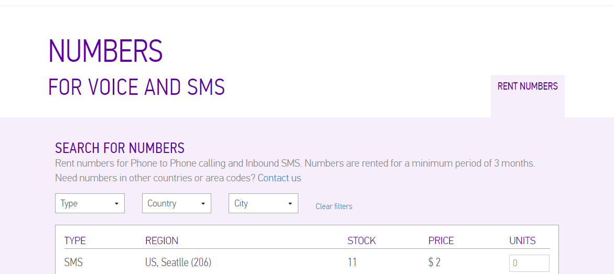
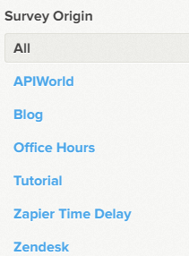

# Building a NPS SMS system with Sinch and Delighted 
Hey, so as many of you know we are using delighted.com for to ask you guys what you think of us. Every time we resolve a support request we ask you if you would share sinch with a friend, we even ask you down in the bottom here about the tutorial. Why do we do that? Well, we want to know we are doing the right thing for you dear developer, and my boss Daniel (Picture of Forsman) will give me the evil eye if this score is not high (no bonus either, lol so please give me 9 or 10). Anyway for more information aobut NPS check out delighted.com its a super imple service to use and as an API guy we like that they have an API. The 28th I am doing a talk on ApiWorld and I thought it would be cool to ask for feedback via SMS if they liked the talk. So today I made a small nuget for interacting with the [Delightful api  ](https://www.nuget.org/packages/Delighted.Api/0.1.1.1) and wanted to show you how you can super easy get incoming SMS and forward that data to delighted.

You can download the code from [Github](https://github.com/sinch/csharp-nps-sms-delighted) or deploy directly to your azure account 
<a href="https://azuredeploy.net/?repository=https://github.com/sinch/csharp-nps-sms-delighted target="_blank">
    
</a>

## Prerequisites 
1. Sinch account and an SMS enabled number https://www.sinch.com/dashboard#/numbers
2. A delightful account https://delighted.com/
2. Some cash on your account
3. A WebApi project

## Set up your account 
Login to your dashboard  https://www.sinch.com/dashboard
click on numbers and rent one, make sure its an SMS enabled number 
 
Choose you apps, and if you dont have one create one and click on the little pen 
, add the number you just rented to the app, and confugure the callback url.
The callback url is where we post incoming messages, and you can read more about that in the [documentation](https://www.sinch.com/docs/sms/#smsmessagingcallbackapi)  

## CODE!

Finally some code, in your WebApi project, add a class in your Models folder and call it **SMSCallbackModel.cs**,  for SMS compared with Callingcallbacks are pretty simple, the SMS is delivered and there is no response required. 
The request contains more info, but for our purpose we just care about the sender and the actual message. So lets add a couple of properties
```csharp
public class SMSCallbackModel {
	public Identity From { get; set; }
	public string Message { get; set; }
}

public class Identity {
	public string Endpoint { get; set; }
}
``` 

So, this is simple enough, just the message and the from as en endpoint, Next lets add add the controller, create a new Empty API controller and call it **SMSController.cs**, next we also want to the delighted nuget so install that in PM .
```ruby
PM> Install-Package Delighted.Api
```
Open up SMSController and add the following code
```csharp
public async Task<HttpResponseMessage> Index(SMSCallbackModel model) {
	var client = new Delighted.Api.Client("yourkey");
	var person = await client.AddPerson(new Person {
    Email = model.From.Endpoint + "@fakedomain.com",
    Send = false
	});
	if (person != null) {
		int score;
 		int.TryParse(model.Message, out score);
		await client.AddResult(new AddResult() {
                    Score = score,
                    PersonId = person.Id.ToString(),
                });
	}
	return new HttpResponseMessage(HttpStatusCode.OK);
}
```
you might wonder why we create an email from the phonenumber, its delighed, they are driven by email so a person must have an email. Second we just check that the creation went smoothly becuase we need the PersonID to create a surevey response. Now, this shoud be good to go, Deplpoy and send an SMS to the number you rented with the a number from 0-10. 
YAY, I suppsed it worked, now one of the things I really value with the feedback system is when you guys gives me comment, so I wanted to add that lets change the code (and here is where it becomes a litle hacky since we are trying to get a number and the rest as comment from an sms), So i decide to ask teh audience to send an SMS with the score and then any comments. I also wanted to track the event with a property on the person. 

```csharp
public async Task<HttpResponseMessage> Index(SMSCallbackModel model) {
	var client = new Delighted.Api.Client("yourkey");
	var person = await client.AddPerson(new Person {
    Email = model.From.Endpoint + "@sinch.com",
    Send = false
	});
	if (person != null) {
		int score;
		//just check if the score is 10, else take the firs character 
        if (model.Message.Substring(0, 2) == "10") {
        	score = 10;
            } else {
            int.TryParse(model.Message.Substring(0, 1), out score);
		}
		//If the mesage has enought lenght get the rest of message as a comment
        string comment = model.Message.Length > 2 ? model.Message.Substring(score == 10 ? 2 : 1) : "";
		//Safty to not add fake zeros        
		if (model.Message != "0" && score == 0)
        	return new HttpResponseMessage(HttpStatusCode.OK);
		//Add a property that we can filter for in delightful  
		var dic = new Dictionary<string, string>();
        dic.Add("survey_origin", "APIWorld");
        await client.AddResult(new AddResult() {
            Score = score,
        	Comment = comment,
            PersonId = person.Id.ToString(),
            Properties = dic
                });
	}
	return new HttpResponseMessage(HttpStatusCode.OK);
}
```
Cool, deplopy and send SMS to the number again with the text "10 awesome" and that should now show up in your portal and you will be able to filter by event. 

I really appreciate if you could click on below and rate what you thought about this tutorial, my bonus depends on it ;)


  

